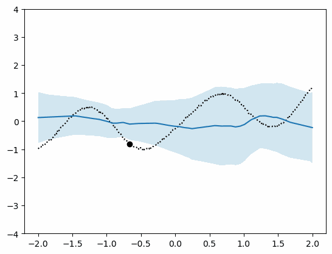

## Neural processes

PyTorch implementation of [(latent) neural processes](https://arxiv.org/abs/1807.01622) for function regression. 

See [`src/model`](https://github.com/jleechung/neural-processes/blob/main/src/model.py) for components of the NP, and [here](https://github.com/jleechung/neural-processes/blob/main/latent-neural-process.ipynb) for a walkthrough of the model and training.    

Set up an environment with:
```
conda env create -n neural-processes -f environment.yaml
```

### Examples

Visualise the predictive mean and variance from the trained NP given increasing number of context points:



### References

See the official [Tensorflow implementation](https://github.com/google-deepmind/neural-processes). 
